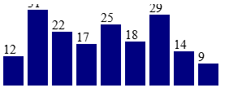
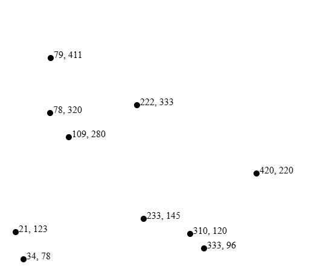
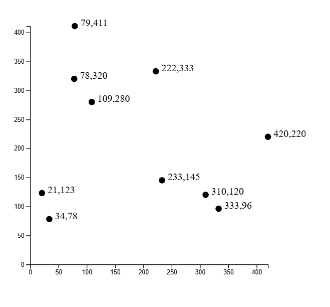

### Learning D3

## How to import d3
    ```html
    <head>
        <script src="https://d3js.org/d3.v6.min.js"></script>
    </head>
    ```

 - `select()` selects the tag in the html. `append()` appends new tag. `text()` adds text in appended tag in the document

    ```html
    <body>
        <script>
            d3.select("body")
            .append("h1")
            .text("Hello");
        </script>
    </body>
    ```
 - We can also add style using `selection.style("color","red")`.

 - Change the styling based on data

    ```js
    selection.style("color", (d) => {
        if(d < 20){
            return "red";
        }
    });
    ```

 - Adding any html attribute to an element using `attr()`

    ```js
    selection.attr("class","container");
    ```

    ```html
    <style>
    .bar {
        width: 25px;
        height: 100px;
        display: inline-block;
        background-color: blue;
    }
    </style>
    <body>
    <script>
        const dataset = [12, 31, 22, 17, 25, 18, 29, 14, 9];

        d3.select("body").selectAll("div")
        .data(dataset)
        .enter()
        .append("div")
        // Add your code below this line
        .attr("class","bar")


        // Add your code above this line
    </script>
    </body>
    ```

 - using rect in svg with attribute width, height, x, and y

    ```js
    const svg = d3.select("body")
        .append("svg")
        .attr("width", w)
        .attr("height", h)
        .append("rect")
        .attr("height",100)
        .attr("width",25)
        .attr("x",0)
        .attr("y",0)
    ```

 - appending rect based on data

    ```js
    const dataset = [12, 31, 22, 17, 25, 18, 29, 14, 9];

    const w = 500;
    const h = 100;

    const svg = d3.select("body")
                  .append("svg")
                  .attr("width", w)
                  .attr("height", h);

    svg.selectAll("rect")
       // Add your code below this line
       .data(dataset)
       .enter()
       .append("rect")


       // Add your code above this line
       .attr("x", 0)
       .attr("y", 0)
       .attr("width", 25)
       .attr("height", 100);
    ```

- using indexes

    ```js
    selection.attr("property", (d, i) => {

    })
    ```

 - sample displaying graph
    
    ```html
    <body>
    <script>
        const dataset = [12, 31, 22, 17, 25, 18, 29, 14, 9];

        const w = 500;
        const h = 100;

        const svg = d3.select("body")
                    .append("svg")
                    .attr("width", w)
                    .attr("height", h);

        svg.selectAll("rect")
        .data(dataset)
        .enter()
        .append("rect")
        .attr("x", (d, i) => i * 30)
        .attr("y", (d, i) => h - 3 * d)
        .attr("width", 25)
        .attr("height", (d, i) => 3 * d)
        .attr("fill", "navy");

        svg.selectAll("text")
        .data(dataset)
        .enter()
        .append("text")
        .text((d) => d)
        .attr("x", (d,i) => i * 30)
        .attr("y", (d,i) => (h - 3 * d) - 3)
    </script>
    <body>
    ```

    

 - Circle in d3

    ```html
    <body>
    <script>
        const dataset = [
                    [ 34,    78 ],
                    [ 109,   280 ],
                    [ 310,   120 ],
                    [ 79,    411 ],
                    [ 420,   220 ],
                    [ 233,   145 ],
                    [ 333,   96 ],
                    [ 222,   333 ],
                    [ 78,    320 ],
                    [ 21,    123 ]
                    ];


        const w = 500;
        const h = 500;

        const svg = d3.select("body")
                    .append("svg")
                    .attr("width", w)
                    .attr("height", h);

        svg.selectAll("circle")
        .data(dataset)
        .enter()
        .append("circle")
        .attr("cx", (d) => d[0])
        .attr("cy", (d) => h - d[1])
        .attr("r", 5)
    </script>
    </body>
    ```

    

 - Sampole with label

    ```html
    <body>
    <script>
        const dataset = [
                    [ 34,    78 ],
                    [ 109,   280 ],
                    [ 310,   120 ],
                    [ 79,    411 ],
                    [ 420,   220 ],
                    [ 233,   145 ],
                    [ 333,   96 ],
                    [ 222,   333 ],
                    [ 78,    320 ],
                    [ 21,    123 ]
                    ];


        const w = 500;
        const h = 500;

        const svg = d3.select("body")
                    .append("svg")
                    .attr("width", w)
                    .attr("height", h);

        svg.selectAll("circle")
        .data(dataset)
        .enter()
        .append("circle")
        .attr("cx", (d, i) => d[0])
        .attr("cy", (d, i) => h - d[1])
        .attr("r", 5);

        svg.selectAll("text")
        .data(dataset)
        .enter()
        .append("text")
        // Add your code below this line
        .text((d) => d[0] + ", " + d[1])
        .attr("x", (d) => d[0] + 5)
        .attr("y", (d) => h - d[1])


        // Add your code above this line
    </script>
    </body>
    ```

    

 - Create linear scale

    ```html
    <body>
        <script>
            const scale = d3.scaleLinear(); // Create the scale here
            const output = scale(50); // Call scale with an argument here

            d3.select("body")
            .append("h2")
            .text(output);

        </script>
    </body>
    ```

 - Settting Domain and Range

    ```html
    <body>
        <script>
            const scale = d3.scaleLinear();
            scale.domain([250, 500]);
            scale.range([10, 150]);

            const output = scale(50);
            d3.select("body")
            .append("h2")
            .text(output);
        </script>
    </body>
    ```

 - Use d3.max and d3.min

    ```js
    // Example 1
    const exampleData = [34, 234, 73, 90, 6, 52];
    d3.min(exampleData)
    d3.max(exampleData)

    // Example 2
    const locationData = [[1, 7],[6, 3],[8, 3]];
    const minX = d3.min(locationData, (d) => d[0]);

    //Example 3
    const positionData = [[1, 7, -4],[6, 3, 8],[2, 9, 3]]
    const output = d3.max(positionData, (d) => d[2]);

    d3.select("body")
      .append("h2")
      .text(output)
    ```
 - Using dynamic scale

    ```html
    <body>
    <script>
        const dataset = [
                    [ 34,    78 ],
                    [ 109,   280 ],
                    [ 310,   120 ],
                    [ 79,    411 ],
                    [ 420,   220 ],
                    [ 233,   145 ],
                    [ 333,   96 ],
                    [ 222,   333 ],
                    [ 78,    320 ],
                    [ 21,    123 ]
                    ];

        const w = 500;
        const h = 500;

        // Padding between the SVG boundary and the plot
        const padding = 30;

        // Create an x and y scale

        const xScale = d3.scaleLinear()
                        .domain([0, d3.max(dataset, (d) => d[0])])
                        .range([padding, w - padding]);

        // Add your code below this line
        const yPadding = 470;
        const yScale = d3.scaleLinear()
                        .domain([0, d3.max(dataset, (d) => d[1])])
                        .range([yPadding, h - yPadding]);


        // Add your code above this line

        const output = yScale(411); // Returns 30
        d3.select("body")
        .append("h2")
        .text(output)
    </script>
    </body>
    ```

 - Add Axes to Virtualization

    ```html
    <body>
    <script>
        const dataset = [
                    [ 34,     78 ],
                    [ 109,   280 ],
                    [ 310,   120 ],
                    [ 79,   411 ],
                    [ 420,   220 ],
                    [ 233,   145 ],
                    [ 333,   96 ],
                    [ 222,    333 ],
                    [ 78,    320 ],
                    [ 21,   123 ]
                    ];

        const w = 500;
        const h = 500;
        const padding = 60;

        const xScale = d3.scaleLinear()
                        .domain([0, d3.max(dataset, (d) => d[0])])
                        .range([padding, w - padding]);

        const yScale = d3.scaleLinear()
                        .domain([0, d3.max(dataset, (d) => d[1])])
                        .range([h - padding, padding]);

        const svg = d3.select("body")
                    .append("svg")
                    .attr("width", w)
                    .attr("height", h);

        svg.selectAll("circle")
        .data(dataset)
        .enter()
        .append("circle")
        .attr("cx", (d) => xScale(d[0]))
        .attr("cy",(d) => yScale(d[1]))
        .attr("r", (d) => 5);

        svg.selectAll("text")
        .data(dataset)
        .enter()
        .append("text")
        .text((d) =>  (d[0] + "," + d[1]))
        .attr("x", (d) => xScale(d[0] + 10))
        .attr("y", (d) => yScale(d[1]))

        const xAxis = d3.axisBottom(xScale);
        // Add your code below this line
        const yAxis = d3.axisLeft(yScale);
        // Add your code above this line

        svg.append("g")
        .attr("transform", "translate(0," + (h - padding) + ")")
        .call(xAxis);

        svg.append("g")
        .attr("transform", "translate(" + padding + ",0)")
        .call(yAxis);
    </script>
    </body>
    ```

    

 ### Handle Click Events with JavaScript using the onclick Property

 You want your code to execute only once your page has finished laoding. For that purpose, you can attach JavaScript event to document called "DOMContentLoaded"

 ```js
 document.addEventListener('DOMContentLoaded', function() {

 });
 ```

### Get JSON with the JavaScript XMLHttpRequest Method

    ```js
    const req = new XMLHttpRequest();
    req.open("GET",'/json/cats.json',true);
    req.send();
    req.onload = function(){
    const json = JSON.parse(req.responseText);
    document.getElementsByClassName('message')[0].innerHTML = JSON.stringify(json);
    };
    ```

### Get JSON with the JavaScript fetch method

    ```js
    fetch('/json/cats.json')
    .then(response => response.json())
    .then(data => {
        document.getElementById('message').innerHTML = JSON.stringify(data);
    })
    ```
### Getting keys in an object

    ```js
    <script>
    document.addEventListener('DOMContentLoaded', function(){
        document.getElementById('getMessage').onclick = function(){
        const req = new XMLHttpRequest();
        req.open("GET",'/json/cats.json',true);
        req.send();
        req.onload = function(){
            const json = JSON.parse(req.responseText);
            let html = "";
            // Add your code below this line
            json.forEach(function(val){
            const keys = Object.keys(val);
            keys.forEach(function(key){
                html += "<strong>" + key + "</strong></br>"
            })
            console.log(html)
            })

            // Add your code above this line
            document.getElementsByClassName('message')[0].innerHTML = html;
        };
        };
    });
    </script>

    <style>
    body {
        text-align: center;
        font-family: "Helvetica", sans-serif;
    }
    h1 {
        font-size: 2em;
        font-weight: bold;
    }
    .box {
        border-radius: 5px;
        background-color: #eee;
        padding: 20px 5px;
    }
    button {
        color: white;
        background-color: #4791d0;
        border-radius: 5px;
        border: 1px solid #4791d0;
        padding: 5px 10px 8px 10px;
    }
    button:hover {
        background-color: #0F5897;
        border: 1px solid #0F5897;
    }
    </style>

    <h1>Cat Photo Finder</h1>
    <p class="message box">
    The message will go here
    </p>
    <p>
    <button id="getMessage">
        Get Message
    </button>
    </p>
    ```

### Using filter

    ```js
    json = json.filter(function(val) {
        return (val.id !== 1);
    });
    ```


    ```html
    <script>
    document.addEventListener('DOMContentLoaded', function(){
        document.getElementById('getMessage').onclick = function(){
        const req = new XMLHttpRequest();
        req.open("GET",'/json/cats.json', true);
        req.send();
        req.onload=function(){
            let json = JSON.parse(req.responseText);
            let html = "";
            // Add your code below this line
            json = json.filter(function(val) {
            return (val.id !== 1);
            });

            // Add your code above this line
            json.forEach(function(val) {
            html += "<div class = 'cat'>"

            html += ""

            html += "</div>"
            });
            document.getElementsByClassName('message')[0].innerHTML = html;
        };
        };
    });
    </script>

    <style>
    body {
        text-align: center;
        font-family: "Helvetica", sans-serif;
    }
    h1 {
        font-size: 2em;
        font-weight: bold;
    }
    .box {
        border-radius: 5px;
        background-color: #eee;
        padding: 20px 5px;
    }
    button {
        color: white;
        background-color: #4791d0;
        border-radius: 5px;
        border: 1px solid #4791d0;
        padding: 5px 10px 8px 10px;
    }
    button:hover {
        background-color: #0F5897;
        border: 1px solid #0F5897;
    }
    </style>

    <h1>Cat Photo Finder</h1>
    <p class="message box">
    The message will go here
    </p>
    <p>
    <button id="getMessage">
        Get Message
    </button>
    </p>
    ```

### Get Geolocation Data to Find A User's GPS Coordinates

    ```js
    if (navigator.geolocation){
    navigator.geolocation.getCurrentPosition(function(position) {
        document.getElementById('data').innerHTML="latitude: " + position.coords.latitude + "<br>longitude: " + position.coords.longitude;
    });
    }
    ```

### Post Data with the JavaScript XMLHttpRequest Method

    ```js
    const xhr = new XMLHttpRequest();
    xhr.open('POST', url, true);
    xhr.setRequestHeader('Content-Type', 'application/json; charset=UTF-8');
    xhr.onreadystatechange = function () {
    if (xhr.readyState === 4 && xhr.status === 201){
        const serverResponse = JSON.parse(xhr.response);
        document.getElementsByClassName('message')[0].textContent = serverResponse.userName + serverResponse.suffix;
    }
    };
    const body = JSON.stringify({ userName: userName, suffix: ' loves cats!' });
    xhr.send(body);
    ```

